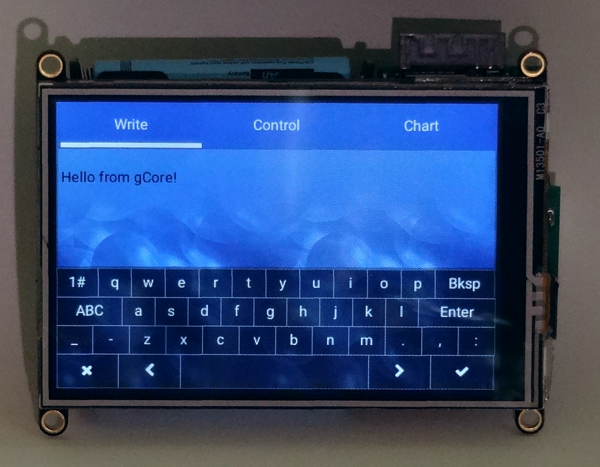
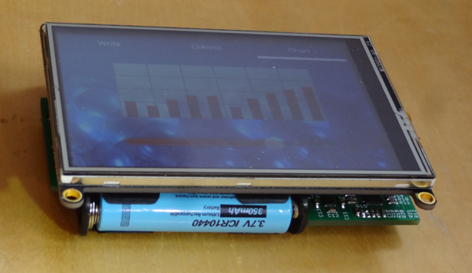
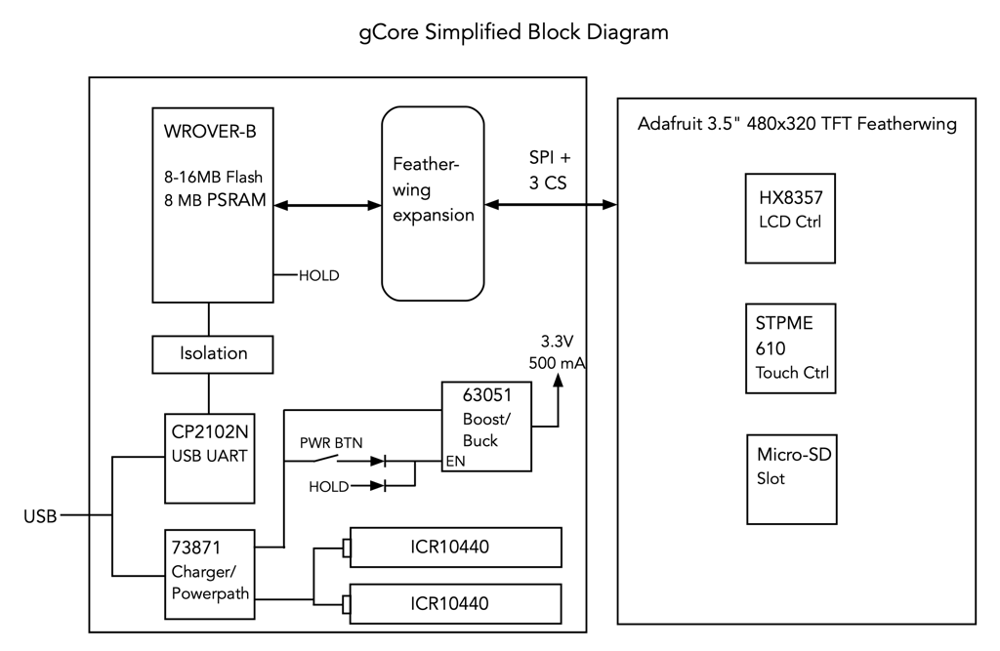
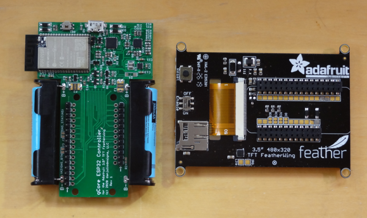
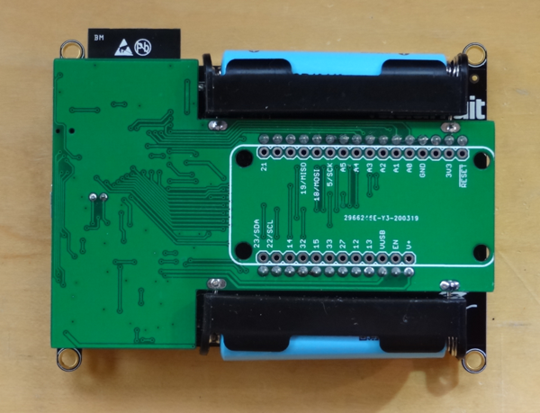
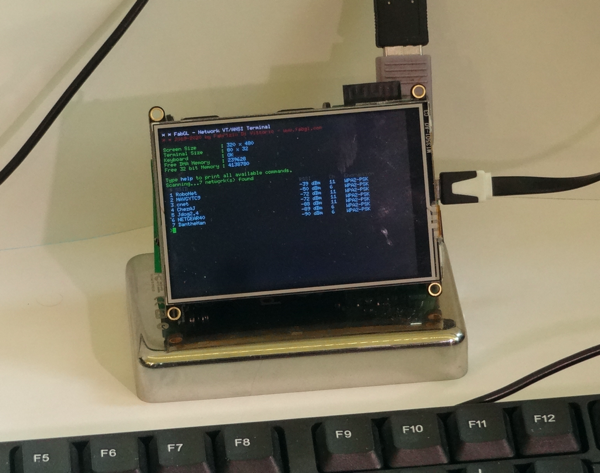

## gCore - A controller for portable GUI-based devices
gCore ("Gadget Core") is an ESP32 development board designed to mate with the [Adafruit TFT Featherwing](https://www.adafruit.com/product/3651) 480x320 pixel 3.5" TFT LCD display with resistive touch.  It contains a WROVER-B module, USB UART, true USB power-bath Li-Ion battery charger, a pair of ICR10440 batteries and a boost/buck 3.3V converter.  It is designed to support soft-power control and battery voltage/charge status monitoring.

gCore is released as open source hardware and supporting software under the GPLv3 license in hopes it will be helpful to others.  This repository contains two subdirectories.

1. hardware - contains eagle design files, gerber files, and documentation.
2. software - arduino library for power control, [LittlevGL](https://github.com/littlevgl) driver for Arduino and [FabGL](https://github.com/fdivitto/FabGL) port.

### gCore Operation
gCore is built around several components.

#### ESP32 Core
The ESP32 is a great micro-controller.  Powerful and inexpensive with a good amount of memory, WiFi, Bluetooth and full complement of peripherals.  Code can be written using Espressif's ESP IDF libraries and development environment or the ESP32 Arduino integration.  gCore uses a WROVER module because it also includes an external 8 MB PSRAM and up to 16 MB built-in flash enabling applications that require a lot of memory at the cost of two IO pins.

#### CP2102N USB UART
A Silicon Labs CP2102N USB UART provides access to the primary ESP32 serial port for programming and debug.  The RTS# and DTR# signals are interfaced to RESET# and IO0 in the traditional way so that external programming software can automatically upload new firmware.  While the ESP32 and other gCore devices are powered from its built-in power system, the CP2102 is powered by the USB port so that it does not add an additional load on the battery.  There is isolation circuitry to reduce sneak current paths between the two power domains.

The CP2102N CHRGEN and CHR0 signals are routed to the MCP73871 to allow for intelligent charge control based on the USB state.  These signals allow it to select a charge current of 0 mA when the USB Bus has been suspended (e.g. laptop sleeping), 100 mA when the USB Bus is running but the USB UART hasn't been enumerated yet or 500 mA when the USB Bus has been enumerated or gCore is connected to a dedicated USB Charger.  These features require the CP2102N be configured using software from Silicon Labs.  Please see the instructions in the Software/CP2102N subdirectory.

#### MCP73871 Load Sharing Charge Controller
A Microchip MCP73871 provides both the battery charging circuit and an intelligent power path that automatically routes power from USB, when available, to the Boost-Buck converter, augmenting it with power from the batteries when necessary.  This allows it to correctly identify when the batteries are charged (a problem with some other development boards that put the load on the same output that is charging the battery).  In addition the charge status signals are connected to a voltage divider network allowing the ESP32 to use an analog input to detect which of four states the charger is in.

* Charge Idle - Not charging.  Power either from USB or battery.
* Charging - Currently charging the battery
* Charge Done - Charging phase finished.  Power from USB.
* Fault - Charger detected a fault (see the spec sheet).

#### TPS63051 Boost-Buck Converter
A TI TPS63051 boost-buck converter provides gCore's 3.3V power supply at up to 500 mA.  Unlike many other development boards that only use a buck-converter (or inefficient linear regulator), it assures a valid 3.3V power supply even when the battery is depleted.  

#### Dual ICR10440 Li-Ion batteries
A pair of AAA-sized Li-Ion batteries allow for relatively thin enclosures.  The batteries are connected in parallel with each battery in series with a PTC to allow them to equalize during charge and discharge and protect from shorts.  They are capable of powering a device for a couple of hours of run-time.  Quality ICR10440 cells can be found on Amazon.  Since the charger can provide up to 450-500 mA when gCore is powered down always use two cells so the per-cell charge current doesn't exceed its recommended maximum.

A larger battery may also be used by connecting it to the terminals of one of the ICR10440 batteries.

#### GPIO Utilization
| GPIO | Function | Notes |
|:----:|:--------:|:-----:|
| IO5  |  SPI SCK | SPI CLK for TFT, Touchscreen and Micro-SD |
| IO14 |   SD CS  | Micro-SD CS# on Adafruit TFT Featherwing |
| IO15 |  TFT CS  | TFT CS# on Adafruit TFT Featherwing |
| IO18 | SPI MOSI | SPI MOSI for TFT, Touchscreen and Micro-SD |
| IO19 | SPI MISO | SPI MISO for Touchscreen and Micro-SD |
| IO32 |   TS CS  | Touchscreen CS# on Adafruit TFT Featherwing |
| IO33 |  TFT DC  | TFT DC on Adafruit TFT Featherwing |
| IO34 | SNS_BTN  | ESP ADC1_CH6/Arduino A2 Button sense analog input |
| IO35 | SNS_BATT | ESP ADC1_CH7 Battery voltage sense analog input |
| IO36 | SNS_STAT | ESP ADC1_CH0/Arduino A4 charge stat sense analog input |

Note that both the SNS\_BTN and SNS\_STAT signals include jumper pads with a cuttable link to disconnect them from the analog input in case their functionality is not needed or the analog input needs to be used for another purpose.  See the schematic in the hardware sub-directory for more detail.

The two featherwing signals normally used to bring out the second ESP32 UART on its IO16 and IO17 pins are not connected because these pins are used internally by the WROVER module to support the PSRAM.