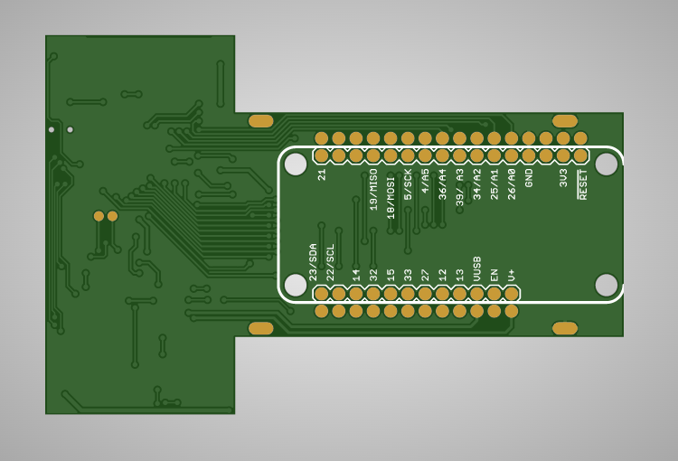

## gCore Hardware Documentation

This directory contains the hardware design for gCore (Rev 2 design).

documentation - BOM, schematic and board layout PDF renders, list of components to be loaded on the PCB.
eagle - Eagle v7.7 design files
gerber - Gerber files for PCB (not including stencil)
stencil - Gerber files for top stencil

### Revision 2 Design Important Note
These files represent the second revision of the design.  To date I have only built the first revision and incorporated a few changes.  The changes were minor and I tested all of them with modifications (bodges) to the first revision. I am very confident that the second revision is correct and will work perfectly but in the spirit of full disclosure I'm letting you know.

#### Rev 2 PCB Top

#### Rev 2 PCB Bottom

### Hardware Notes

1. Turn the power switch located on the Adafruit TFT LCD featherwing to the ON position.  This allows the LCD backlight to be lit when 3.3V power comes on and also gives the ability to use the GPIO2 output on the STMPE610 touchscreen controller to turn it on and off under software control.

2. The CHREN and CHR0 signals between U1 (CP2102N) and U2 (MCP73871) are designed to work in conjunction with reconfiguring U1 via Simplicity Studio Xpress Configurator to support USB Charger detection.  Do not stuff R13 and R14 if you will not reconfigure U1 to enable charging (500 mA).

2. Cut J3 between the pads if you do not want the power button sense circuitry attached to an analog input or you wish to attach it to a different analog input (connect a wire from the right pad to the desired analog input).

4. Cut J4 between the pads if you do not want the charge sense circuitry attached to an analog input or you wish to attach it to a different analog input (connect a wire from the right pad to the desired analog input).

5. Two pins (J6-14, J6-15) on the featherwing expansion port are not connected.  On Sparkfun and Adafruit ESP32 featherwings these are connected to ESP32 GPIO 16 and 17.  However these pins are not available on the gCore's WROVER-B module.  They are used internally for the 8 MB SPIRAM chip.

6. J1 is an optional jumper between the two USB data lines.  It should not be necessary and was included in case you ever attach a power supply to gCore that does not short the data lines.  The CP2102N will enable charging because it thinks the bus is not enumerated and there is no charger attached.  But be sure to remove the jumper before connecting to a computer!