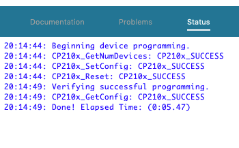

## CP2102N Configuration
The Silicon Labs CP2102N USB UART used by gCore supports the ability to automatically identify USB Chargers and use that information along with information about the USB Bus enumeration (when plugged into a computer) to indicate the amount of current that legally can be taken from the USB bus on a pair of signals (CHREN and CH0).

* No current allowed - USB Suspended (e.g. laptop sleeping)
* 100 mA max - Un-enumerated USB Bus
* 500 mA max - Enumerated bus or USB Charger detected

These signals are connected to the MCP73871 charge controller on gCore (note: see the note in the hardware directory about how to enable charging if you do not reconfigure the CP2102N as shown here).  The charge controller is configured to supply a maximum of 0 mA, 100 mA or about 500 mA to both batteries for charging depending on the state of these signals.

Unfortunately this functionality is not enabled by default.  The instructions in the included Silicon Labs app note `AN721.pdf` show how to download and install a utility or the Simplicity Studio development environment that allows reconfiguration of the CP2102N via its USB interface and Silicon Labs Xpress Configurator.

The following changes need to be made via Xpress Configurator:

1. Reconfigure the maximum USB Current to 500 mA.
2. Enable Battery Charging functionality with a maximum current of 500 mA.

The images below show the changes I make to the default values read from the CP2102N by Xpress Configurator.

For some reason the version of the Xpress Configurator I used from within Simplicity Studio did not automatically check the "User Internal Serial Number" button.  You need to do this if you wish to keep the factory-programmed serial number in each CP2102N.

After making the changes it is a quick process to program them to the device.

