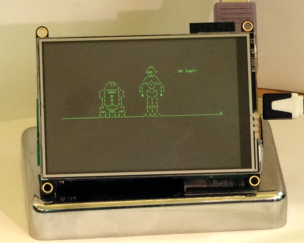

# FabGL

## gCore Modifications
This directory contains the modified FabGL code to work with gCore.  Primarily this includes adding support for the HX8357 TFT driver.  I had to modify FabGL to support a higher resolution TFT display (480x320) that included a new buffer scheme because the existing software architecture caused the ESP32 to run out of memory at that resolution; as well as modify the terminal to support more than 25 lines.

* `src/fabglconf.h` - Added a modeline for 480x320 pixel TFT display.
* `src/terminal.cpp` - Added support for a maximum of 32 lines.
* `src/dispdrivers/TFTControllerGeneric.cpp` - Many changes including reducing SPI frequency to 26 MHz and modifying the SPI transactions, changing malloc allocation to use a different buffer scheme and fixing a bug in the TFT orientation code.
* `src/dispdrivers/TFTControllerGeneric.h` - Added new DMA buffer.
* `src/dispdrivers/TFTControllerSpecific.cpp` - Added support for HX8357 TFT driver.
* `src/dispdrivers/TFTControllerSpecific.h` - Added support for HX8357 TFT driver.

The examples in this directory were ported to gCore.  I used GPIO13 for PS/2 keyboard data and GPIO27 for PS/2 keyboard clock wired the way Fabrizio recommends.  The examples here also include the gCore power management functionality with automatic low-battery shutdown and soft power off by pressing and holding the power button.

## Original FabGL README contents
### Display Controller, PS/2 Mouse and Keyboard Controller, Graphics Library, Sound Engine, Graphical User Interface (GUI), Game Engine and ANSI/VT Terminal for the **ESP32**

**[Please look here for full API documentation](http://www.fabglib.org)**

If you would like to **support FabGL's development**, please see the [**Donations page**][Donations].
You can also support me getting my own [development board](https://www.tindie.com/products/fabgl/fabgl-development-board/).

This library works with ESP32 revision 1 or upper. See [**Compatible Boards**][Boards].

FabGL is mainly a Graphics Library for ESP32. It implements several display drivers (for direct VGA output and for I2C and SPI LCD drivers).
FabGL can also get input from a PS/2 Keyboard and a Mouse. FabGL implements also: an Audio Engine, a Graphical User Interface (GUI), a Game Engine and an ANSI/VT Terminal.

This library works with ESP32 revision 1 and upper.

VGA output requires a digital to analog converter (DAC): it can be done by three 270 Ohm resistors to have 8 colors, or by 6 resistors to have 64 colors.

There are several fixed and variable width fonts embedded.

Unlimited number of sprites are supported. However big sprites and a large amount of them reduces the frame rate and could generate flickering.

When there is enough memory (on low resolutions like 320x200), it is possible to allocate two screen buffers, so to implement double buffering.
In this case primitives are always drawn on the back buffer.

Except for double buffering or when explicitly disabled, all drawings are performed on vertical retracing (using VGA driver), so no flickering is visible.
If the queue of primitives to draw is not processed before the vertical retracing ends, then it is interrupted and continued at next retracing.

There is a graphical user interface (GUI) with overlapping windows and mouse handling and a lot of widgets (buttons, editboxes, checkboxes, comboboxes, listboxes, etc..).

Finally, there is a sound engine, with multiple channels mixed to a mono output. Each channel can generate sine waveforms, square, etc... or custom sampled data.

### Installation Tutorial (click for video):

### Space Invaders Example (click for video):

### Graphical User Interface - GUI (click for video):

### Sound Engine (click for video):

### Altair 8800 emulator - CP/M text games (click for video):

### Commodore VIC20 emulator (click for video):

### Simple Terminal Out Example (click for video):

### Network Terminal Example (click for video):

### Modeline Studio Example (click for video):

### Loopback Terminal Example (click for video):

### Double Buffering Example (click for video):

### Collision Detection Example (click for video):

[Donations]: https://github.com/fdivitto/FabGL/wiki/Donations
[Boards]: https://github.com/fdivitto/FabGL/wiki/Boards
