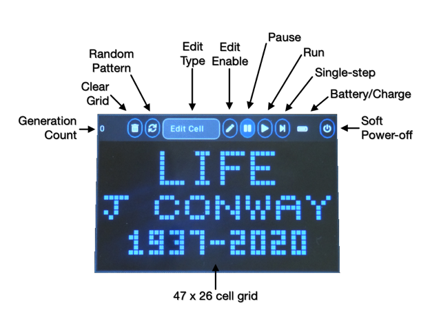

## gCore native LittlevGL Demo
This demo shows native LittlevGL integration along with a version of the gCore power management functions into the native Esspressif IDF.  It is based on the [ESP32 port of LittlevGL](https://github.com/littlevgl/lv_port_esp32).  Along with the demo application the gCore specific parts include the TFT and Touchscreen drivers and power management functions.

[John Conway](https://en.wikipedia.org/wiki/John_Horton_Conway), father of the Game of Life program, passed away due to complications from the COVID-19 virus while I was deciding what demo to write to show off gCore and LittlevGL.  This demo is my tribute to him and his contributions.

I built this demo using v3.5 of the [ESP IDF](https://github.com/espressif/esp-idf).  It should compile with no or few changes in the v4.X version.  It uses various LittlevGL controls such as buttons, drop-down menu, labels and canvas.  It's best used with a plastic pointer designed for resistive touch screens (especially when editing individual cells).

gCore Life implements Conway's original [Life](https://en.wikipedia.org/wiki/Conway%27s_Game_of_Life) algorithm.  It also includes a bunch of classic life cell collections that made interesting objects such as "gliders", a "glider gun", "spaceships" and more that can be added to the grid.  It's pretty demanding of the LittlevGL rendering system and I can get about 6 generations/second although the actual Life alorithm is very fast.

The grid with a "glider gun" above a left moving "spaceship".

