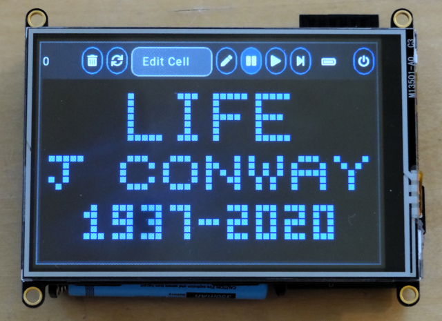
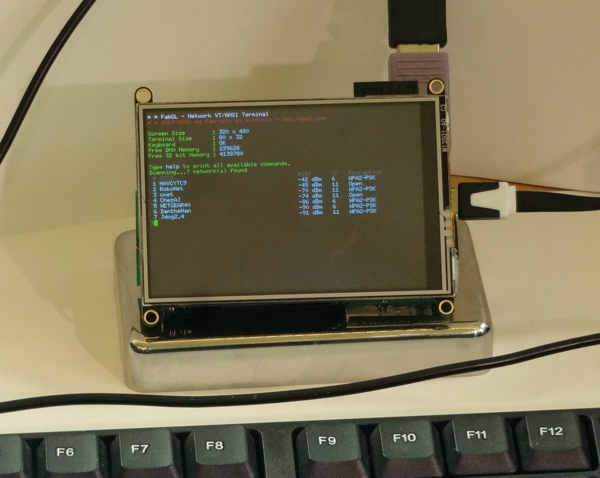

## gCore software support

This directory contains software support for gCore to provide TFT and touchscreen drivers and power management functions for both Arduino and ESP IDF development environments.  See each subdirectory for more information.

* Arduino - A pair of demos for ESP32 Arduino including gCore power management and [LittlevGL/Arduino](https://github.com/littlevgl/lv_arduino) integration.
* CP2102N - Instructions for enabling automatic USB charger detection in the Silicon Labs CP2102N USB UART.  This allows gCore to correctly set charge current levels based on the USB interface.
* FabGL - A port of Fabrizio Di Vittorio's fantasic [FabGL](https://github.com/fdivitto/FabGL) library to gCore.
* LittlevGL - A native v3.5 ESP-IDF demo project showing [Native LittlevGL](https://github.com/littlevgl/lvgl) integration.

